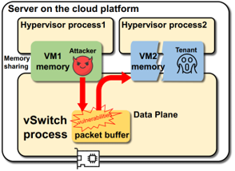
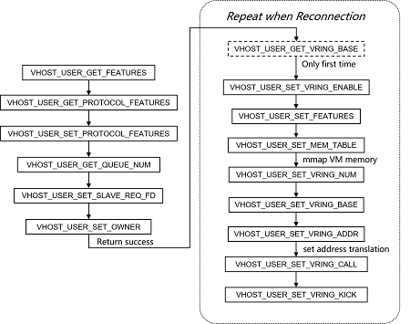
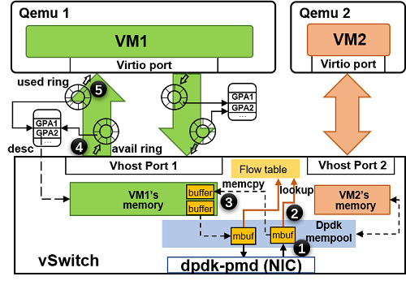

Secure-vhost is an isolation enhanced vhost-user para-virtualized network I/O. 
It is built for the cloud platform, which runs VMs in high density. The VM memory 
isolation breakage in vhost-user may bring security risks for VMs on cloud. So 
in secure-vhost, we modify the memory sharing model to copy packets between VM 
and the host more securely.

## What is the VM isolation issue in vhost-user solution?

A secure risk in tranditional vhost-user network I/O solution is that all VMs' 
whole memory is shared to DPDK accelarated vSwitch (e.g. OVS-DPDK) for memory 
copying between VM buffer and host buffer. A malicious tenant may take control 
the userspace vSwitch and **"legally"** access these VMs' memory. And even worse, 
this kind of illegal memory access is not easy to detected because it occurs 
totally in user space.

To make it clear, we use a example to describe this kind of illegal memory access 
as below:

<p align="left">
  
<p/>

In this figure, the malicious tenant firstly sends a well-designed packet to 
the user space vSwitch, then the vSwitch triggers a vulnerability to run the 
malicious code in the packet payload. By exploiting the feature that vSwitch 
can access all VMs' whole memory without restriction, the VM1's malicious code 
in packet payload can easily access VM2's whole memory. In this way, the key 
data of VM2 will be leaked and the stability is also threatened.

The vulnerability in open vSwitch can be: https://www.cvedetails.com/cve/CVE-2016-2074/. 
Though the vulnerability has been fixed, then what about other unknown vulnerabilities.

The community also has noticed this issue, they proposed a vIOMMU solution: 
http://www.linux-kvm.org/images/c/c5/03x07B-Peter_Xu_and_Wei_Xu-Vhost_with_Guest_vIOMMU.pdf. 
In this enhanced solution, each time when vSwitch needs to access VM's memory 
for packet copying, it should firstly send a socket based message to query QEMU 
process for address translation. The address translation done by the software 
vIOMMU can confirm the legitimacy of VM memory access. However, frequent 
communication will reduce performance to 20%, with severe packet loss (when using 
kernel driver inside the VM). So it is rarely used for practical environments.

## What is secure-vhost?

To solve the security issue in vhost-user without dropping performance, we propose 
secure-vhost. In secure-vhost, we removed the insecure memory sharing, so VM memory 
do not need to be shared to any other processes. We transfered packet copying task 
from vSwitch to QEMU, so that vSwitch should securely share its host packet buffer 
to QEMU. As VM's main process, each QEMU process is responsible for the packet copying 
task of a particular VM. In our theory, QEMU is more trusty than vSwitch and it can 
access the VM memory inside it by default. So this kind of memory sharing and packet 
copying is more secure.

More security discussion can be seen in paper: 
>Ye Yang, Haiyang Jiang, Yongzheng Liang, Yulei Wu, Yilong Lv, Xing Li and Gaogang 
Xie, "Isolation Guarantee for Efficient Virtualized Network I/O on Cloud Platform" 
(accepted by HPCC-2020). See https://ieeexplore.ieee.org/document/9408002.

## What is the difference between IVSHMEM, NetVM and secure-vhost?

About ten years ago, a noval virtualized network I/O solution was proposed. That eventually 
develops the well-known IVSHMEM and NetVM. They all adopt the memory sharing mechanism that shares 
vSwitch's host packet buffer among all VMs, so that the packet copying is eliminated. 
All VMs can operate such a block of memory transparently. Once the packet is DMAed from 
hardware NIC to the host buffer, the vSwitch can notify the corresponding VM to access 
it (rather than copying it, just directly operating the memory in host buffer). 

The weakness of NetVM and IVSHMEM is also obvious, VM can access the packets belonging to 
other VMs. So that solution was abandoned by the community.

For secure-vhost, we do not share host buffer directly to VM (that is insecure!). We share 
host buffer from vSwitch to QEMU process (which is out of the access from tenants). QEMU is 
part of the hypervisor, which is maintained by cloud service providers. It is trusty and with 
higher privilege. At the same time, we can also use `Intel PKEY` and other means to allow 
the shared memory can only be accessed by copy thread and it is invisible for other threads 
(such as VCPU threads). This will further prevent some edge channel attacks.

As the price, one time of memory copying is inevitable in secure-vhost (while IVSHMEM and 
NetVM are zero-copy solutions).

## How to compile secure-vhost?

The prototype system was implmented based on `DPDK-17.11.2`, `OVS-2.9.2` and `qemu-2.10.0-rc3`.

This demo has been successfully built on:

```
OS: Ubuntu 16.04.1 (Kernel 4.15.0-142-generic)
CPU: Intel(R) Xeon(R) CPU E5-4603 v2 @ 2.20GHz
NIC: Intel 82599ES 10-Gigabit Dual Port NIC
```

But it has not been verified on other platforms yet.

To compile this demo, you should compile DPDK first:

```
cd dpdk-eal-master/
make install T=x86_64-native-linuxapp-gcc DESTDIR=install
```

Then compile SPDK:

```
cd ../spdk/
./configure --with-dpdk=../dpdk-eal-master/x86_64-native-linuxapp-gcc
make
```

*The SPDK here is used to release the CPU from the heavy memory copying task, and 
to complete the memory-memory DMA operation via IOAT DMA engine. But as far as we 
know, the latest version of DPDK already supports this kind of DMA operation, and 
SPDK is no longer needed if you want to compile secure-vhost into higher version 
DPDK.*

Compile and install OVS:

```
cd ../openvswitch-2.9.2/
./boot.sh
./configure --with-dpdk=../dpdk-eal-master/x86_64-native-linuxapp-gcc
make
make install
```

Compile and install QEMU:

```
cd ../qemu-2.10.0-rc3/
./compile.sh
```
**You need to change the path in compile.sh according to your situation!**

To use OVS, there is nothing different with the original version. We give 
examples in `start-vswitchd.sh` and `bridge.sh`. You can use:

```
./start-vswitchd.sh
./bridge.sh -n <n(VM number)>
```

But for QEMU, we added DPDK EAL commands before QEMU commands. The two kinds of 
commands are separated by "--". 

An example is as below:

```
./qemu-system-x86_64 -c 14 -w 0000:00:04.0 -- -machine accel=kvm -cpu host -smp...
```

Here, the `-c 14` means the PD thread (packet copying thread, see "**2.The memory 
sharing and data path**") will be bond to CPU core 14. Please note that the 
scheduling strategy of PD threads is "SCHED_FIFO", so **do not** use this CPU core 
to do anything else for it will always be occupied by the PD thread. We recommend 
to bind PD thread to an isolated CPU core.

For specific commands for booting VM, you can learn from script `setup.sh`.

Please check the **PATH** inside all of the scrpts that you want to use and make 
sure they really meets your actual situation.


## What is the difference between vhost-user and secure-vhost?

Secure-vhost is implemented based on vhost-user. The main difference between 
vhost-user and secure-vhost is the memory sharing and packet copying. So that 
means secure-vhost can achieve the same compatibility and scalability as 
vhost-user. And the transport from vhost-user to secure-vhost is not perceived 
by tenants.

In detail designs, there are three main points to illustrate:

**1.The data path establishment**

In vhost-user, before the data path established, there is an socket based 
channel to negotiate some configurations. The procedures are shown as the 
following figure:

<p align="left">
  
<p/>

The most important step is to process message `VHOST_USER_SET_MEM_TABLE`, which 
is to call `"mmap()"` function to map VM's whole memory into vSwitch's memory 
address. 

In secure-vhost, we modified this message processing fuction. QEMU does not send 
fd to vSwitch for `"mmap()"` VM memory. Instead, QEMU sends query message to vSwitch 
for the name of `mbuf_pool`. Then in QEMU, it can easily operate packets in this 
`mbuf_pool` transparently. 

**2.The memory sharing and data path**

To make it clear the data path difference between the two solutions, we show both 
architectures in detail:

<p align="left">
  
<p/>

***vhost-user***

<p align="left">
  
<p/>

***secure-vhost***

Comparing these two figures, it is easy to find that each packet only needs one time 
of memory copying from host buffer to VM memory. The only change exists in shared memory 
and the packet copier.

In secure-vhost, to allow QEMU access vSwitch's host buffer, we compile QEMU into 
DPDK EAL. So all QEMU processes and vSwitch process can operate the packets in `mbuf_pool` 
concurrently.

**3.The scheduling of PD threads**

As each VM has a separated PD thread for copying packets. The CPU consumption will increase. 
To make it more CPU-friendly, we schedule multiple PD threads on the same CPU core. 

But under Linux default "SCHED_OTHER" scheduling, one PD thread may be preempted when it is 
in the critical zone. And that will cause serious dead lock (see "Known Issues" in http://doc.dpdk.org/guides/prog_guide/env_abstraction_layer.html). 
So we set all PD threads under "SCHED_FIFO" and let each PD thread copy one batch of packets 
before it calls `"sched_yield()"` to yield CPU core for others.

## How to use secure-vhost in latest version of the open source software?

As secure-vhost is implemented on the old version of the open source software. Someone may 
want to use it in latest version. But unfortunately, this demo is deeply coupled in the 
software code. We can only give a guide about how to modify the original files to implement 
the main function of secure-vhost.

```
For DPDK:
dpdk-eal-master/lib/librte_vhost/vhost_user.c
dpdk-eal-master/lib/librte_vhost/virtio_net.c
```

In `vhost_user.c`, we modified the socket message processing functions.

In `virtio_net.c`, we removed the memory copying and added notification.

```
For QEMU:
vl.c
qemu-2.10.0-rc3/hw/virtio/vhost-user.c
qemu-2.10.0-rc3/hw/virtio/vhost.c
```

In `vl.c`, we added DPDK init function and DPDK command parse funtion.

In `vhost.c`, we added the PD thread creation and initialization.

In `vhost-user.c`, we modified the socket message processing functions, and we added 
the main loop of PD thread and the packet copying function.

